# ТЕТРИС

[](https://github.com/Carte1972/classic_tetris/actions/workflows/ci.yml)

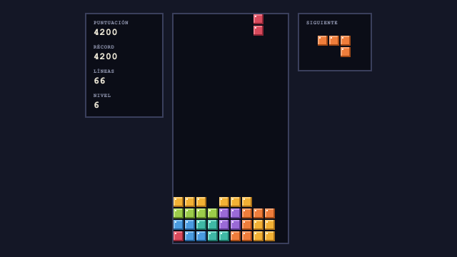

**ТЕТРИС** (Tetris) es un juego de bloques que caen, fiel a las reglas del clásico de NES (1989), hecho con TypeScript, React y Canvas. Se juega en el navegador. Todo el juego cabe en un único archivo `index.html` que funciona abierto con doble clic, sin servidor ni conexión, y viene con lanzadores para macOS, Linux y Windows.

Se juega delante de una **Plaza Roja viva** en pixel-art, vista desde San Basilio como en las postales, con paseantes, palomas, ciclo de día y noche, tiempo cambiante y **eventos típicos** que van ocupando la plaza: el desfile de la Victoria, la Pascua ortodoxa, el mercadillo de Navidad, los fuegos artificiales, Maslenitsa y la fiesta de los campeones olímpicos. Cada nivel tiene un **objetivo de líneas**; al superarlo, uno de los 9 personajes sale a bailar la danza cosaca durante 10 segundos en su propio escenario ruso. Incluye música chiptune sintetizada en tiempo real, efectos de sonido, récords y preferencias guardadas.

## Índice

- [Capturas de pantalla](#capturas-de-pantalla)
- [Jugar](#jugar)
- [Controles](#controles)
- [Reglas y puntuación](#reglas-y-puntuación)
- [La Plaza Roja](#la-plaza-roja)
- [Desarrollo](#desarrollo)
- [Lanzadores y publicación de una release](#lanzadores-y-publicación-de-una-release)
- [Vídeo explicativo](#vídeo-explicativo)
- [Arquitectura](#arquitectura)
- [Estructura de carpetas](#estructura-de-carpetas)
- [Contribuir](#contribuir)
- [Tiempo y tokens](#tiempo-y-tokens)
- [Créditos](#créditos)

## Capturas de pantalla

|                                                                                                                                                                                       |                                                                                                                                                                                           |
| :-----------------------------------------------------------------------------------------------------------------------------------------------------------------------------------: | :---------------------------------------------------------------------------------------------------------------------------------------------------------------------------------------: |
|               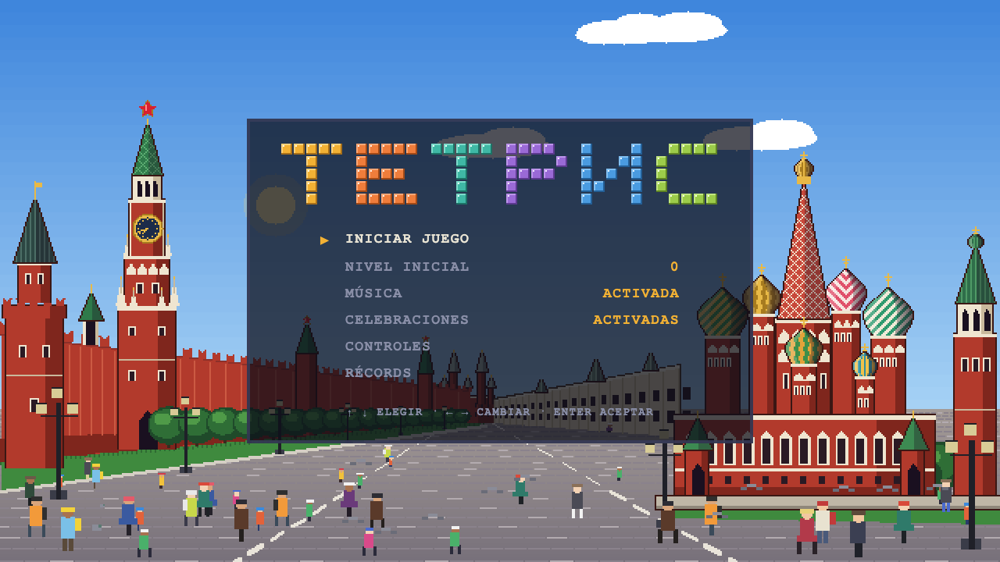                |         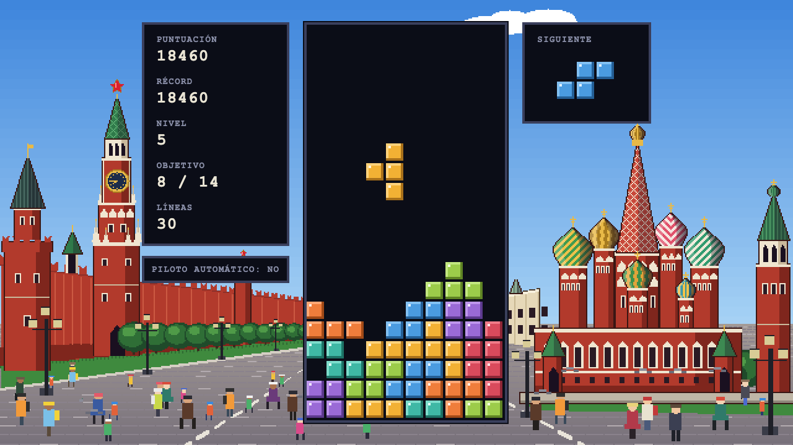          |
|                                                                          Pantalla de inicio: título y menú.                                                                           |                                                       Partida en curso: marcador con el objetivo del nivel, pozo y siguiente pieza.                                                       |
|                   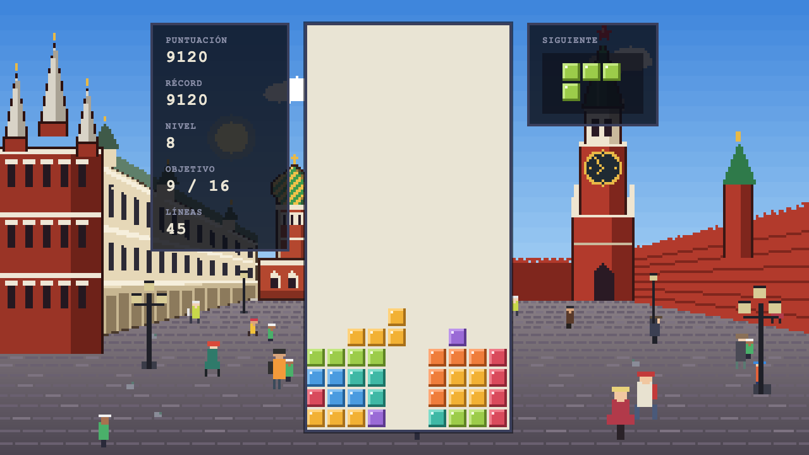                    |                                                  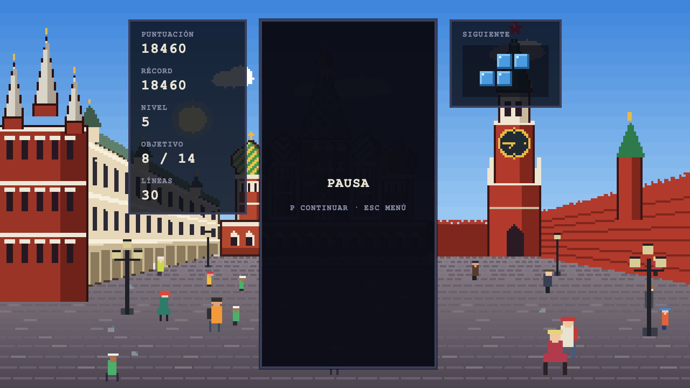                                                   |
|                                                                   Limpieza de 4 líneas a la vez: el pozo destella.                                                                    |                                                                         Pausa: el tablero se oculta, como en NES.                                                                         |
|                           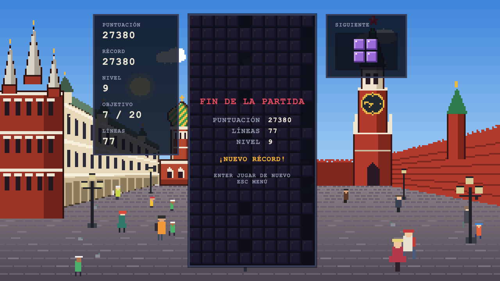                            |                                                     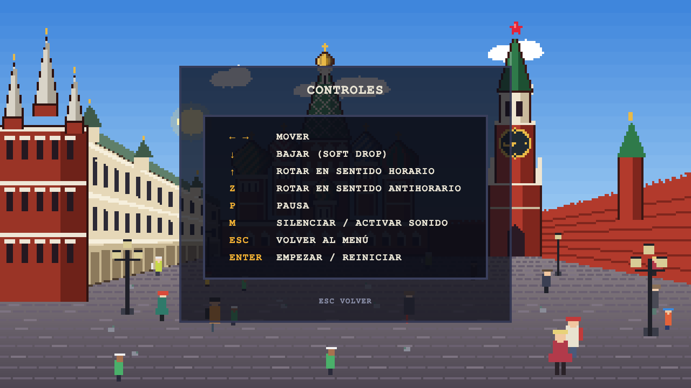                                                      |
|                                                                      Fin de la partida con la puntuación final.                                                                       |                                                                                  Pantalla de controles.                                                                                   |
| 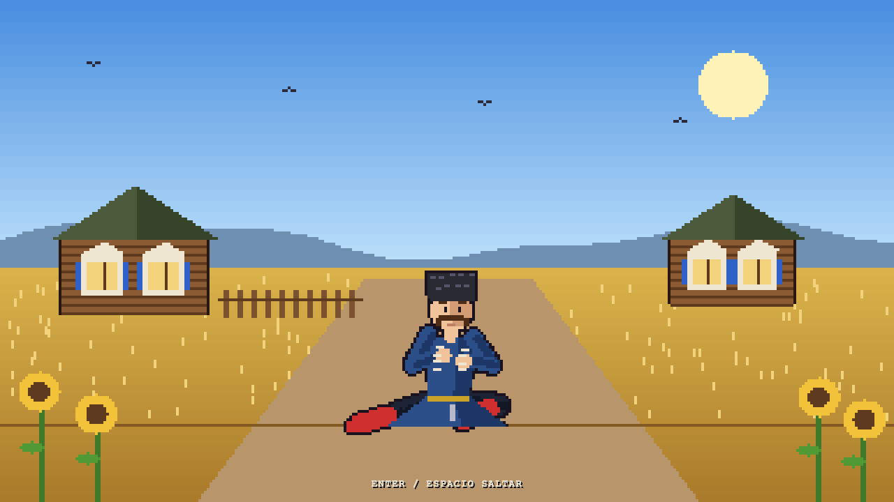 | 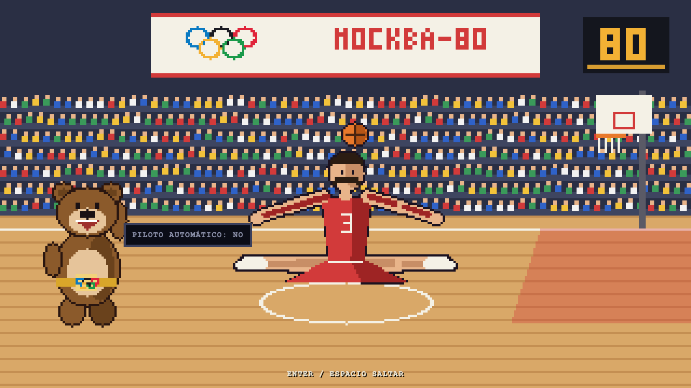 |
|                                                                      El cosaco en plena prisiadka, en la estepa.                                                                      |                                                                   El gigante del baloncesto en el pabellón de Moscú-80.                                                                   |

### Eventos de la Plaza Roja

|                                                                                                                                                                      |                                                                                                                                                                               |
| :------------------------------------------------------------------------------------------------------------------------------------------------------------------: | :---------------------------------------------------------------------------------------------------------------------------------------------------------------------------: |
|   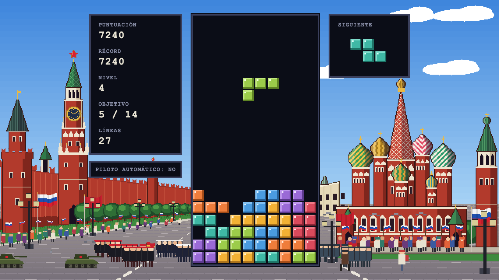   | 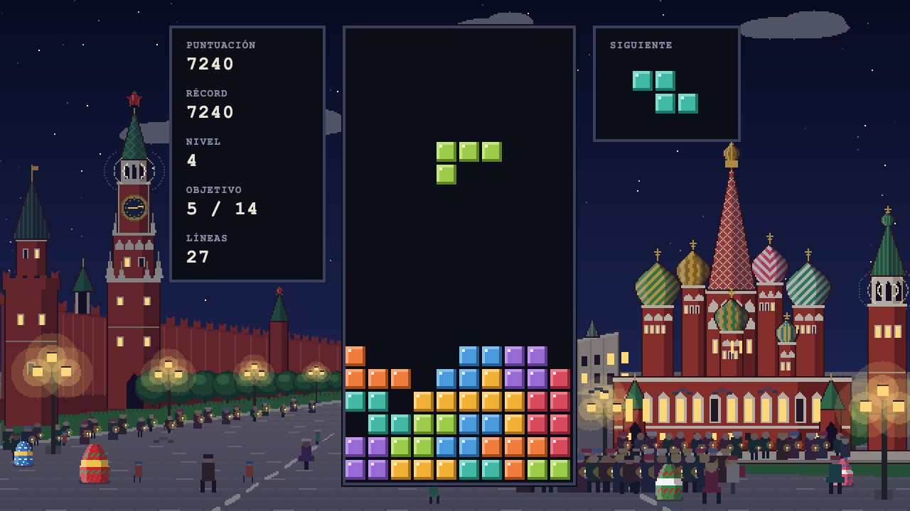 |
|                                                                       Desfile de la Victoria.                                                                        |                                                                               Pascua ortodoxa.                                                                                |
| 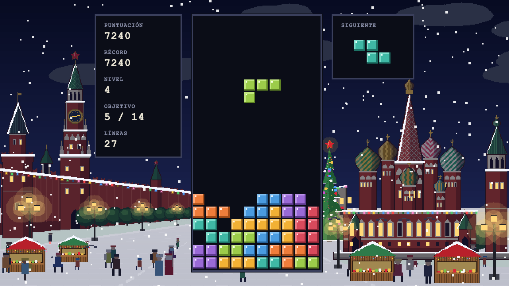 |                          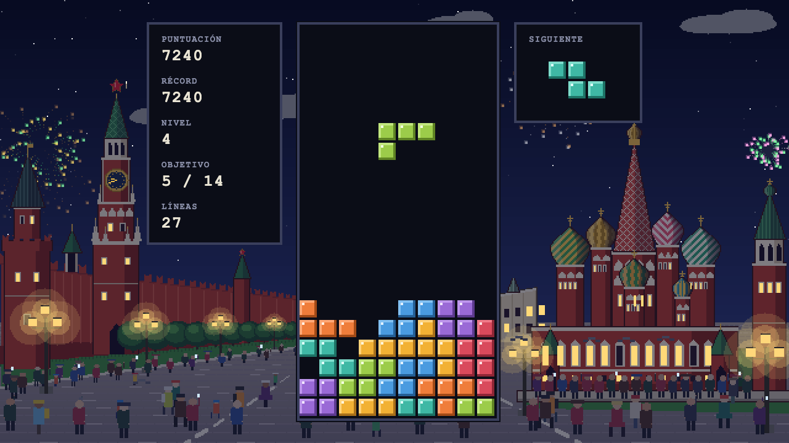                           |
|                                                                         Navidad y Año Nuevo.                                                                         |                                                                             Fuegos artificiales.                                                                              |
|         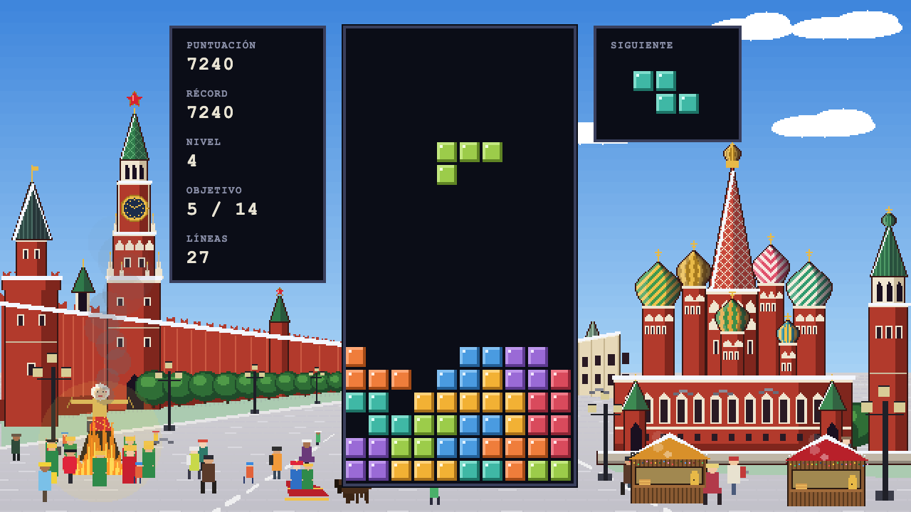          |      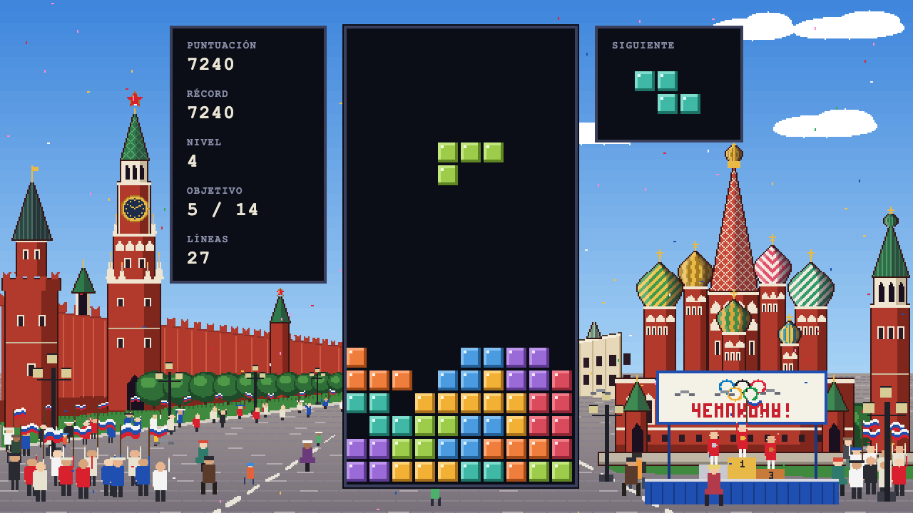      |
|                                                                             Maslenitsa.                                                                              |                                                                             Campeones olímpicos.                                                                              |

Las capturas se generan automáticamente con `npm run screenshots` (ver [Capturas reproducibles](#capturas-reproducibles)).

## Jugar

Para jugar solo necesitas un **navegador moderno** (Chrome, Edge, Firefox o Safari). No hay que instalar nada.

1. Descarga `tetris-vX.Y.Z.zip` de la última versión en [Releases](https://github.com/Carte1972/classic_tetris/releases).
2. Descomprímelo.
3. Haz doble clic en el lanzador de tu sistema:

| Sistema | Lanzador         | Si el sistema lo bloquea                                |
| ------- | ---------------- | ------------------------------------------------------- |
| macOS   | `Tetris.command` | Ver [Gatekeeper](#macos-gatekeeper)                     |
| Linux   | `tetris.sh`      | Ver [permiso de ejecución](#linux-permiso-de-ejecución) |
| Windows | `Tetris.bat`     | Ver [SmartScreen](#windows-smartscreen)                 |

También puedes abrir `index.html` directamente con el navegador.

> Los récords y las preferencias se guardan en el `localStorage` del navegador, asociados a la ruta del archivo. Si mueves la carpeta, empezarás con los récords en blanco.

### Lanzadores sin firmar

Los lanzadores no están firmados digitalmente (firmarlos requiere certificados de pago), así que la primera vez el sistema puede avisarte. Son scripts de texto de pocas líneas: puedes abrirlos con un editor y comprobar que solo abren `index.html` en tu navegador.

#### macOS (Gatekeeper)

Si aparece _"no se puede abrir porque es de un desarrollador no identificado"_:

- Haz **clic derecho** (o Control + clic) sobre `Tetris.command` → **Abrir** → **Abrir**. Solo hace falta la primera vez.
- O quita la marca de cuarentena desde Terminal, dentro de la carpeta del juego:

  ```bash
  xattr -d com.apple.quarantine Tetris.command
  ```

Al ejecutarse se abre una ventana de Terminal que puedes cerrar en cuanto aparezca el juego en el navegador.

#### Windows (SmartScreen)

Si aparece _"Windows protegió su PC"_, pulsa **Más información** → **Ejecutar de todas formas**.

#### Linux (permiso de ejecución)

Si el gestor de archivos abre `tetris.sh` en un editor en vez de ejecutarlo:

```bash
chmod +x tetris.sh
./tetris.sh
```

O activa _"Permitir ejecutar el archivo como un programa"_ en sus propiedades. El lanzador usa `xdg-open`, que viene en casi todas las distribuciones de escritorio.

## Controles

| Tecla           | Acción                                                                      |
| --------------- | --------------------------------------------------------------------------- |
| ← →             | Mover la pieza (si se mantiene, se repite: DAS de 16 frames y luego cada 6) |
| ↓               | Bajar más rápido (soft drop); hay que volver a pulsarla en cada pieza       |
| ↑               | Rotar en sentido horario                                                    |
| Z               | Rotar en sentido antihorario                                                |
| P               | Pausa                                                                       |
| M               | Silenciar / activar todo el sonido                                          |
| Esc             | Volver al menú (o atrás en las pantallas del menú)                          |
| Enter           | Empezar / reiniciar (y aceptar en el menú)                                  |
| Enter o Espacio | Saltar la celebración al superar un nivel                                   |

En el menú: ↑ ↓ para elegir, ← → para cambiar el valor de una opción y Enter para aceptar.

### Menú

- **Iniciar juego**.
- **Nivel inicial**: de 0 a 9, como en NES.
- **Música**: activada o desactivada (los efectos siguen sonando).
- **Celebraciones**: activa o desactiva los bailarines al superar un nivel (si están desactivadas, solo aparece el rótulo «¡NIVEL N!» durante 2 segundos).
- **Controles**: la tabla de teclas.
- **Récords**: las 10 mejores partidas con puntuación, líneas, nivel y fecha.

El nivel inicial, la música, las celebraciones y el silencio (M) se guardan entre sesiones.

## Reglas y puntuación

ТЕТРИС parte de las reglas del juego clásico de NES, no de las versiones modernas, con un sistema de niveles por objetivos y una dificultad que crece en cada nivel:

- **Tablero** de 10 columnas × 20 filas visibles, más 2 filas ocultas encima. Las piezas aparecen en las dos primeras filas visibles; las ocultas dejan sitio para girarlas en vertical nada más aparecer.
- **7 piezas**: I, O, T, S, Z, J, L.
- **Generador aleatorio clásico**, sin "bolsa de 7": se sortea una pieza y, si sale la misma que la anterior, se sortea otra vez y ese resultado se acepta siempre. En el nivel 0 todas las piezas tienen la misma probabilidad; después, el sorteo se va inclinando hacia las piezas difíciles (ver [Dificultad](#dificultad)).
- **Rotación de NES**, sin _wall kicks_: si la pieza girada choca con una pared o con otros bloques, simplemente no gira.
- **Una sola pieza de vista previa** (hasta el nivel 14). No hay _hold_ ni _hard drop_.
- **Retardos de NES**: entre una pieza y la siguiente hay una espera de 10 a 18 frames según la altura a la que se fijó, que se acorta en cada nivel. Al completar líneas, las filas desaparecen desde el centro durante unos 20 frames.
- **Fin de la partida** cuando una pieza nueva no cabe al aparecer.

### Puntuación

| Líneas a la vez | Puntos             |
| --------------- | ------------------ |
| 1               | 40 × (nivel + 1)   |
| 2               | 100 × (nivel + 1)  |
| 3               | 300 × (nivel + 1)  |
| 4               | 1200 × (nivel + 1) |

El nivel que cuenta es el que tenías antes de completar las líneas. Por ejemplo, 4 líneas en el nivel 5 dan 1200 × 6 = 7200 puntos. El **soft drop** suma 1 punto por cada fila que la pieza baja mientras mantienes ↓.

### Niveles y velocidad

- Cada nivel tiene un **objetivo de líneas**: 10 en el primer nivel de la partida y 2 más en cada nivel siguiente (10, 12, 14…). El marcador muestra el progreso en **OBJETIVO** (por ejemplo, `7 / 12`) y las líneas totales en **LÍNEAS**.
- Al alcanzar el objetivo, la partida se detiene, se celebra el nivel y el siguiente empieza con el **tablero vacío** y más velocidad. Las líneas que sobrepasan el objetivo no cuentan para el nivel siguiente.
- El nivel inicial (0–9) se elige en el menú. No hay final: se juega hasta perder.
- La velocidad de caída sigue la tabla de NES a 60 fps (frames por fila):

| Nivel  | 0   | 1   | 2   | 3   | 4   | 5   | 6   | 7   | 8   | 9   | 10–12 | 13–15 | 16–18 | 19–28 | 29+ |
| ------ | --- | --- | --- | --- | --- | --- | --- | --- | --- | --- | ----- | ----- | ----- | ----- | --- |
| Frames | 48  | 43  | 38  | 33  | 28  | 23  | 18  | 13  | 8   | 6   | 5     | 4     | 3     | 2     | 1   |

- La música se acelera un 15 % cuando hay bloques en las 5 filas superiores.

### Dificultad

Además de caer más rápido, cada nivel pone las piezas más difíciles y da menos ayudas:

- **Piezas más difíciles**: la S y la Z pesan 1 + 0,05 × nivel en el sorteo (hasta 2) y la I, 1 − 0,025 × nivel (hasta 0,5); el resto pesa 1. En el nivel 10, una S o una Z sale el doble que una I.
- **Menos tiempo entre piezas**: la espera de entrada baja 1 frame por nivel, sin bajar de 4.
- **Sin vista previa** desde el nivel 15: el panel de la siguiente pieza muestra «OCULTA».

### Celebraciones

Cada vez que superas un nivel, la partida se congela y sale a bailar un personaje, en este orden y en rotación (`(niveles superados − 1) % 9`), cada uno en su escenario:

| Nivel superado | Personaje                                     | Escenario                                               |
| -------------- | --------------------------------------------- | ------------------------------------------------------- |
| 1.º, 10.º…     | El cosaco                                     | La estepa, con isbas y girasoles                        |
| 2.º, 11.º…     | La matrioska, que se abre y saca otra pequeña | Un taller de artesanía                                  |
| 3.º, 12.º…     | El oso pardo con su balalaika                 | La taiga, con abedules                                  |
| 4.º, 13.º…     | La babushka                                   | La cocina de una isba, con samovar                      |
| 5.º, 14.º…     | El cosmonauta                                 | La rampa de lanzamiento, con un cohete que despega      |
| 6.º, 15.º…     | El gran maestro de ajedrez                    | El salón de columnas, con un tablero gigante            |
| 7.º, 16.º…     | El gigante del baloncesto                     | El pabellón de Moscú-80, con los aros olímpicos y Misha |
| 8.º, 17.º…     | La bailarina                                  | El escenario del teatro Bolshói                         |
| 9.º, 18.º…     | Rasputín (caricatura)                         | Un salón del Kremlin                                    |

La coreografía dura unos 10 segundos: entrada, _prisiadka_ con patadas alternas, giro, salto abierto tocándose las puntas de los pies, otra tanda de patadas con palmas, reverencia y salida, mientras suena _Kalinka_ con estribillo y estrofa. Enter o Espacio la saltan.

## La Plaza Roja

El fondo es la Plaza Roja vista desde San Basilio, con el encuadre de las postales: a la izquierda, la muralla del Kremlin con las torres Nabátnaya, Tsárskaya y Spásskaya (cuyo reloj marca la hora del juego); a la derecha, la catedral de San Basilio con su campanario; al fondo, el Museo Histórico y los almacenes GUM. El pozo, el marcador y la siguiente pieza son opacos y crecen con la ventana (a múltiplos enteros, para que el pixel-art siga nítido), así que la plaza se ve a los lados mientras juegas.

- **Vida normal**: paseantes de distintos tipos (con paraguas cuando llueve) y palomas que echan a volar si alguien se acerca.
- **Día y noche**: una vuelta completa cada 3 minutos, con amanecer, atardecer, estrellas, farolas y ventanas encendidas.
- **Tiempo**: despejado, nublado, lluvia (con charcos) o nieve (que cuaja en el suelo y en los tejados); cambia más o menos cada minuto.
- **Eventos**: cada 2–3 minutos la plaza se llena con uno de estos, a la hora y con el tiempo que le corresponden, junto a parte de los paseantes:

| Evento                 | Cuándo            | Qué se ve                                                                                                                                                         |
| ---------------------- | ----------------- | ----------------------------------------------------------------------------------------------------------------------------------------------------------------- |
| Desfile de la Victoria | De día            | Columnas de soldados, marinos y cadetes con la Bandera de la Victoria, tanques T-34, lanzacohetes Katiusha, aviones con estelas tricolores y público con banderas |
| Pascua ortodoxa        | De noche          | Procesión con cruz, estandartes, iconos y fieles con velas, campanas repicando, San Basilio iluminado y huevos de Pascua gigantes                                 |
| Navidad y Año Nuevo    | Con nieve         | Mercadillo de casetas de madera, abeto con la estrella roja, guirnaldas en la muralla, el GUM y San Basilio, y Ded Moroz con Snegúrochka                          |
| Fuegos artificiales    | De noche          | Cohetes y palmeras de colores sobre el Kremlin y San Basilio, con destellos que iluminan la plaza                                                                 |
| Maslenitsa             | De día, con nieve | Muñeco de paja que acaba ardiendo, corro con trajes tradicionales, casetas de blinis con samovar y una troika                                                     |
| Campeones olímpicos    | De día            | Podio con los medallistas, cartel con los aros olímpicos, aficionados con banderas y confeti                                                                      |

## Desarrollo

### Requisitos previos

- **Node.js 22 o superior** (el CI usa Node 24 LTS) con npm. Comprueba la versión con `node --version`. Si no lo tienes:
  - macOS: `brew install node` o el instalador de [nodejs.org](https://nodejs.org).
  - Windows: `winget install OpenJS.NodeJS.LTS` o el instalador de [nodejs.org](https://nodejs.org).
  - Linux: el gestor de paquetes de tu distribución o [nvm](https://github.com/nvm-sh/nvm) (`nvm install --lts`).
- **Git**.

No hace falta Rust ni ninguna otra herramienta nativa: el juego es solo web.

### Instalación

```bash
git clone https://github.com/Carte1972/classic_tetris.git
cd classic_tetris
npm ci
```

### Comandos

| Comando                 | Qué hace                                                                                                      |
| ----------------------- | ------------------------------------------------------------------------------------------------------------- |
| `npm run dev`           | Servidor de desarrollo con recarga en caliente (abre la URL que muestra, normalmente `http://localhost:5173`) |
| `npm run build`         | Typecheck y build de producción: un único `dist/index.html` autocontenido                                     |
| `npm run preview`       | Sirve el build de `dist/`                                                                                     |
| `npm run typecheck`     | Comprueba los tipos (`tsc --noEmit`)                                                                          |
| `npm run lint`          | ESLint sin errores ni avisos permitidos                                                                       |
| `npm run format`        | Formatea con Prettier (para comprobar sin cambiar: `npx prettier --check .`)                                  |
| `npm test`              | Tests unitarios (Vitest)                                                                                      |
| `npm run test:coverage` | Tests unitarios con cobertura; falla si el motor (`src/engine/`) baja del 90 %                                |
| `npm run test:e2e`      | Tests end-to-end (Playwright) en Chromium y WebKit, contra el build de producción                             |
| `npm run package`       | Genera `release/tetris-vX.Y.Z.zip` con el juego y los lanzadores (requiere `npm run build`)                   |
| `npm run screenshots`   | Regenera las capturas y el GIF de `docs/screenshots/`                                                         |
| `npm run video`         | Regenera desde cero el vídeo explicativo (ver [Vídeo explicativo](#vídeo-explicativo))                        |

Antes de ejecutar los tests e2e o las capturas por primera vez, instala los navegadores de Playwright:

```bash
npx playwright install chromium webkit
```

Para ejecutar un solo test:

```bash
npx vitest run tests/unit/engine/step.test.ts      # un archivo de tests unitarios
npx vitest run -t "limpia 4 líneas"                 # tests cuyo nombre contiene un texto
npx playwright test tests/e2e/menu.spec.ts --project=chromium
```

### Modo test

Para los tests e2e y las capturas, el juego admite dos parámetros en la URL:

- `?seed=123` fija la semilla del generador aleatorio y de la escena de fondo, así todas las partidas son reproducibles.
- `?test=1` expone `window.__tetris`, que permite leer el estado y preparar situaciones como un tablero casi lleno, un nivel a punto de superarse, un fotograma concreto de la celebración, o una hora, un tiempo y un evento concretos en la Plaza Roja. También puede ocultar la interfaz para ver solo la plaza (lo usa el vídeo explicativo).

Sin esos parámetros el juego funciona con normalidad.

### Capturas reproducibles

`npm run screenshots` arranca el build de producción y genera las capturas con Playwright, usando la semilla fija, estados preparados con el modo test y el reloj del navegador simulado y en pausa (el juego y la escena de fondo solo avanzan cuando el script lo pide). Así cada ejecución produce exactamente las mismas imágenes. El GIF lo juega un jugador automático que elige dónde colocar cada pieza. Si cambias el aspecto del juego, vuelve a generarlas y revísalas antes de hacer commit.

## Lanzadores y publicación de una release

Como el juego es un único `index.html`, "compilar para cada sistema" se reduce a acompañarlo de un lanzador por sistema:

- `launchers/Tetris.command` (macOS), `launchers/tetris.sh` (Linux) y `launchers/Tetris.bat` (Windows) abren el juego en el navegador predeterminado. Buscan `index.html` junto a ellos (en el zip de la release) o en `../dist/` (en el repositorio clonado, después de `npm run build`). Si no lo encuentran, explican qué hacer.
- `npm run package` crea `release/tetris-vX.Y.Z.zip` con `index.html`, los tres lanzadores (con permiso de ejecución en macOS y Linux) y un `LEEME.txt`.

Para jugar desde el repositorio clonado:

```bash
npm run build
./launchers/Tetris.command   # macOS (o doble clic en Finder)
./launchers/tetris.sh        # Linux
launchers\Tetris.bat         # Windows
```

### Publicar una release

El workflow [`release.yml`](.github/workflows/release.yml) se ejecuta al subir un tag `v*`. Comprueba que el tag coincide con la versión de `package.json`, pasa los tests, genera el build y el zip y crea una GitHub Release con el zip adjunto.

```bash
npm version 1.2.0 --no-git-tag-version   # actualiza la versión en package.json
git commit -am "chore: publica la versión 1.2.0"
git push
git tag v1.2.0
git push origin v1.2.0
```

En unos minutos la release aparece en [Releases](https://github.com/Carte1972/classic_tetris/releases) con `tetris-v1.2.0.zip`. No hace falta compilar en cada sistema operativo: el mismo zip sirve para los tres. El workflow de CI ([`ci.yml`](.github/workflows/ci.yml)) prueba los lanzadores en macOS, Ubuntu y Windows en cada push.

## Vídeo explicativo

El proyecto incluye un vídeo explicativo de unos 2 minutos, narrado en español, para quien nunca ha jugado. Cuenta de dónde viene el juego, cómo se juega, los controles, la Plaza Roja y sus eventos, las celebraciones y los récords. Todo lo que se ve son grabaciones reales del juego y rótulos con su misma estética.

Se regenera desde cero con un solo comando:

```bash
npm run video
```

Requisitos: **macOS** (la narración usa `say` con la voz del sistema; se grabó con la Voz 1 de Siri), **ffmpeg** (`brew install ffmpeg`) y Chromium de Playwright (`npx playwright install chromium`). Tarda unos 10 minutos y deja el resultado en `video/salida/`:

- `tetris_video_explicativo.mp4` (1920 × 1080, 30 fps, H.264 y AAC, a −16 LUFS);
- `miniatura.png` (1280 × 720).

Cómo se hace:

1. **Narración** (`video/scripts/narrar.mjs`): cada frase del guion (`video/narracion.mjs`) se genera con `say` como un clip independiente, con un tratamiento ligero de voz.
2. **Música y efectos** (`video/scripts/audio.spec.ts`): se renderizan con `OfflineAudioContext` usando el mismo código de `src/audio/` que suena al jugar.
3. **Grabaciones** (`video/scripts/grabaciones.spec.ts`): se graban fotograma a fotograma contra el build de producción, con el modo test, la semilla fija y el reloj simulado, así que son reproducibles. Cada grabación guarda en un JSON lo que ocurre en el juego (líneas, fin de partida, teclas…) para colocar los efectos y sincronizar la voz.
4. **Rótulos** (`video/rotulos/`): páginas HTML que reutilizan los bloques y el título del juego, capturadas con fondo transparente.
5. **Montaje** (`video/scripts/montaje.mjs`): ffmpeg une las escenas, baja la música bajo la voz y normaliza el volumen. Los tiempos se calculan a partir de la duración real de cada frase.

El guion está en `video/guion.md`, los datos históricos con sus fuentes en `video/fuentes.md` y el informe de verificación en `video/informe_video.md`. Los vídeos, audios y grabaciones generados no se suben al repositorio.

## Arquitectura

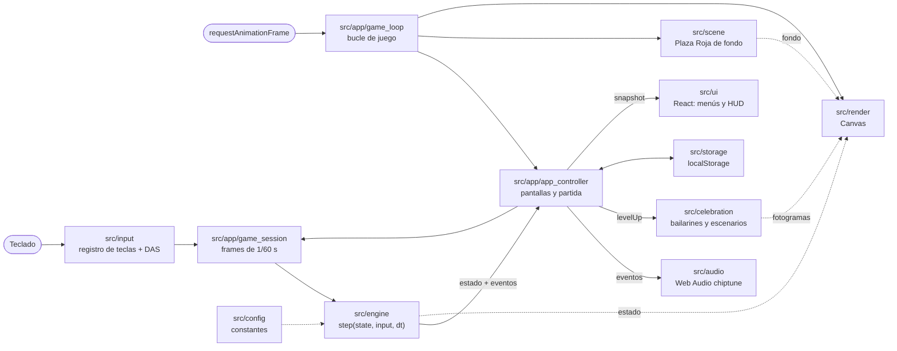

### Bucle de juego

1. `requestAnimationFrame` llama al bucle (`src/app/game_loop.ts`) en cada refresco de pantalla con el tiempo transcurrido, limitado a 250 ms para no dar saltos al volver de otra pestaña.
2. El controlador (`src/app/app_controller.ts`) lee las teclas que tocan en la pantalla actual: menú, partida, pausa, celebración o fin de partida.
3. Durante la partida, `game_session` reparte el tiempo en **frames fijos de 1/60 s**. En cada frame lee el teclado (desplazamiento con DAS y rotaciones) y llama a `step(state, input, dt)` del motor. Así el juego va igual de rápido en pantallas de 60, 120 o 144 Hz y no se pierden pulsaciones.
4. La escena de fondo (`src/scene/`) avanza su propio reloj: hora del día, tiempo atmosférico, gente y calendario de eventos.
5. Después se dibujan el fondo, el pozo y, si toca, la celebración en sus canvas, y React actualiza menús y marcador solo cuando cambia algo visible.

### Flujo de estado

- **El motor (`src/engine/`) es puro**: no sabe nada de React, del DOM ni del audio. `step` recibe el estado anterior y devuelve un estado nuevo, inmutable, junto con una lista de **eventos** (`pieceMoved`, `pieceRotated`, `pieceLocked`, `linesCleared`, `levelUp`, `gameOver`). Una partida pasa por las fases `falling` → `lineClear` → `entryDelay` → `falling`… Al alcanzar el objetivo pasa a `levelComplete`, y `startNextLevel` empieza el nivel siguiente con el tablero vacío; así hasta `gameOver`. La semilla del generador forma parte del estado, así que la misma semilla da siempre la misma partida.
- **El controlador reparte los eventos**: los efectos de sonido, la aceleración de la música, la celebración al recibir `levelUp` y el récord al recibir `gameOver`. La pausa y la celebración congelan la partida dejando de llamar a `step`; al terminar la celebración, el controlador empieza el nivel siguiente.
- **La interfaz solo pinta**: los componentes de `src/ui/` reciben una "foto" (`snapshot`) del controlador mediante `useSyncExternalStore` y no contienen lógica de juego. La navegación del menú es una función pura (`menu_navigation.ts`).
- **Todo lo configurable está en `src/config/`**: tablero, piezas y rotaciones, tablas de gravedad y puntuación, retardos, teclas, colores, textos, sonido y celebraciones.

### Audio, fondo y celebraciones

- La música y los efectos se sintetizan con osciladores de onda cuadrada y triangular. No hay archivos de audio. Un secuenciador programa las notas por adelantado sobre el reloj de audio para que el ritmo sea estable. Las canciones están escritas como texto (`NOTA:pasos`) en `src/audio/songs/`. El audio arranca con la primera tecla ("PULSA CUALQUIER TECLA") porque los navegadores lo bloquean hasta que hay interacción.
- La Plaza Roja (`src/scene/`) se dibuja con formas de píxeles nítidos a 640 × 360 píxeles lógicos y se escala a pantalla completa. Los edificios se pintan una vez en capas de día y de noche (San Basilio en una capa aparte, para tapar a quien pasa por detrás) y cada fotograma las mezcla según la hora; el cielo, la gente, las palomas, las farolas y la lluvia o la nieve se calculan en cada fotograma y se ordenan por profundidad. Un calendario puro (`src/scene/events/event_schedule.ts`) alterna la vida normal con los eventos según la hora del día; cada evento (`src/scene/events/`) aporta sus figurantes y decorados, dibujos en el cielo y adornos en los edificios, y pide el tiempo atmosférico que le corresponde.
- Los bailarines (`src/celebration/`) son pixel-art de alta resolución animado con un **esqueleto**: la coreografía da los ángulos de cada articulación en cada instante, un cálculo de cinemática directa coloca huesos y manos, y cada personaje viste ese esqueleto con su ropa, su cabeza y sus accesorios, con contorno y sombreado. Cada escenario es una función de dibujo con sus propias animaciones (el cohete que despega, el público del pabellón…). Una máquina de estados pura decide qué personaje sale y en qué momento del baile va.

## Estructura de carpetas

```text
.
├── index.html                 Página del juego (con el favicon incrustado)
├── src/
│   ├── main.tsx               Punto de entrada de React
│   ├── config/                Constantes: tablero, piezas, gravedad, puntuación, teclas, colores, textos…
│   ├── engine/                Motor puro: tablero, piezas, rotación NES, colisiones, gravedad, puntuación, step()
│   ├── input/                 Teclado: teclas mantenidas y pulsadas, DAS
│   ├── render/                Dibujo en Canvas: pozo, siguiente pieza, animación de limpieza, título
│   ├── audio/                 Sintetizador, secuenciador, efectos y canciones (Korobeiniki, Kalinka)
│   ├── scene/                 Plaza Roja de fondo: edificios, cielo, gente, día y noche, tiempo y eventos
│   ├── celebration/           Celebraciones: esqueleto y coreografía, 9 bailarines y sus escenarios
│   ├── storage/               Preferencias y récords en localStorage
│   ├── app/                   Bucle de juego, controlador de pantallas, sesión de partida, modo test
│   └── ui/                    Componentes React: inicio, menú, HUD, pausa, fin de partida, celebración
├── tests/
│   ├── unit/                  Tests unitarios (Vitest), con la misma estructura que src/
│   ├── e2e/                   Tests end-to-end (Playwright)
│   └── screenshots/           Generación de las capturas y del GIF del README
├── launchers/                 Lanzadores para macOS, Linux y Windows, y el LEEME del zip
├── scripts/                   Empaquetado del zip de la release (sin dependencias)
├── docs/screenshots/          Capturas generadas para este README
├── video/                     Vídeo explicativo: guion, fuentes, narración, grabaciones, rótulos y montaje
├── .github/workflows/         CI (comprobaciones, e2e, lanzadores) y release
├── prompt_tetris.md           Especificación original del proyecto y cambios acordados
└── prompt_video.md            Especificación del vídeo explicativo y cambios acordados
```

## Contribuir

¡Las contribuciones son bienvenidas!

1. Haz un fork y crea una rama a partir de `main`.
2. Sigue las convenciones del proyecto:
   - **Código en inglés; comentarios, JSDoc y documentación en español.**
   - TypeScript estricto: nada de `any`, tipos explícitos y JSDoc en todo lo que se exporta.
   - Sin números mágicos: las constantes van en `src/config/`.
   - Archivos en `snake_case`, salvo los componentes de React (`PascalCase`).
   - El motor (`src/engine/`) debe seguir siendo puro, sin React, DOM ni audio.
   - Sin `console.log`, `TODO` ni `FIXME` en el código entregado.
3. Haz commits pequeños con [Conventional Commits](https://www.conventionalcommits.org/es/): tipo en inglés y descripción en español, por ejemplo `feat(engine): añade detección de colisiones`.
4. Antes de abrir el pull request, comprueba que todo pasa:

   ```bash
   npx tsc --noEmit
   npm run lint
   npx prettier --check .
   npm run test:coverage
   npm run test:e2e
   npm run build
   ```

   Si tu cambio afecta al aspecto del juego, regenera las capturas con `npm run screenshots`.

5. No desactives tests, reglas de lint ni el umbral de cobertura para que algo pase: corrige la causa.

El CI ejecuta las mismas comprobaciones, los e2e y la prueba de los lanzadores en cada push y pull request.

## Tiempo y tokens

El juego y el vídeo explicativo se desarrollaron en una sola sesión de desarrollo asistido por IA, entre el 1 y el 2 de octubre de 2026. Las cifras salen del registro de esa sesión.

|                             | Juego       | Vídeo explicativo | Total        |
| --------------------------- | ----------- | ----------------- | ------------ |
| Tiempo con actividad        | 5,5 h       | 2,9 h             | 8,4 h        |
| Tokens nuevos leídos        | 3,28 M      | 1,52 M            | 4,80 M       |
| Tokens releídos de la caché | 251,9 M     | 146,0 M           | 397,9 M      |
| Tokens generados            | 1,04 M      | 0,23 M            | 1,27 M       |
| **Precio estimado**         | **97,41 $** | **45,97 $**       | **143,38 $** |

- **M** = millones de tokens.
- El **vídeo** se cuenta desde que se pidió, incluidos sus ajustes y su documentación. Lo anterior es el **juego**: especificación, tres iteraciones, tests, capturas y release.
- El **tiempo con actividad** suma solo los intervalos de menos de 15 minutos sin actividad, así que no cuenta las pausas largas. Sí incluye el tiempo de revisar, escuchar y responder.
- **Tokens nuevos leídos:** todo el texto que el asistente lee por primera vez (mensajes, archivos, resultados de comandos y tests, imágenes). Se guarda en caché para no tener que procesarlo de nuevo.
- **Tokens releídos de la caché:** en cada respuesta el asistente vuelve a leer la conversación entera hasta ese momento, pero desde la caché, que cuesta mucho menos.
- **Tokens generados:** todo lo que escribe el asistente: respuestas, código, órdenes y razonamiento.
- El **precio estimado** es el que costaría con la API de Claude Opus 5.5 pagando por uso. No es lo que se paga con una suscripción (Pro o Max), que tiene cuota fija. Precios por millón de tokens, de [claude.com/pricing](https://claude.com/pricing) y de la [documentación de caché](https://platform.claude.com/docs/en/build-with-claude/prompt-caching), consultados el 2 de octubre de 2026:

| Tokens nuevos (escritura en caché de 1 h) | Tokens releídos de la caché | Tokens generados |
| ----------------------------------------- | --------------------------- | ---------------- |
| 8 $                                       | 0,20 $                      | 20 $             |

Unos 1.700 tokens nuevos no pasaron por la caché y se cobran a 4 $ por millón; no cambian el total.

## Créditos

© 2026 Carte1972. Todos los derechos reservados.

- **"Korobeiniki"**: melodía tradicional rusa del siglo XIX, de dominio público. El arreglo chiptune (segunda voz y bajo) es original de este proyecto.
- **"Kalinka"**: canción popular rusa de 1860, de dominio público. El arreglo chiptune (bajo y rasgueos) es original de este proyecto. La melodía se transcribió de una versión en [notación ABC](https://abcnotation.com/tunePage?a=trillian.mit.edu%2F%7Ejc%2Fmusic%2Fabc%2FRussia%2FKalinka%2F0000).
- Gráficos, personajes, escenarios, paleta de colores, efectos de sonido y código son originales del proyecto. La Plaza Roja y sus eventos se inspiran en sus edificios y celebraciones reales, dibujados de nuevo en pixel-art. Rasputín aparece como caricatura del personaje histórico. Los aros olímpicos y Misha, la mascota de los Juegos Olímpicos de Moscú 1980, aparecen como homenaje en el escenario del pabellón; sus titulares no están afiliados a este proyecto ni lo respaldan.

ТЕТРИС es un homenaje independiente, sin ánimo de lucro, al Tetris clásico de NES. «Tetris» es una marca registrada de Tetris Holding, con licencia a The Tetris Company; este proyecto no está afiliado ni respaldado por ellas ni por los titulares de ninguna otra marca comercial.
